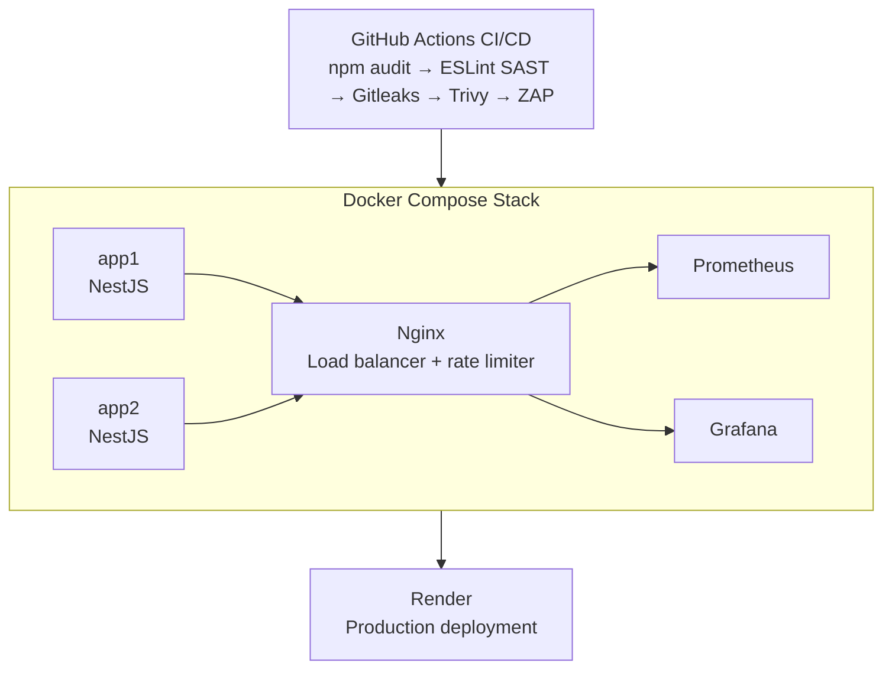
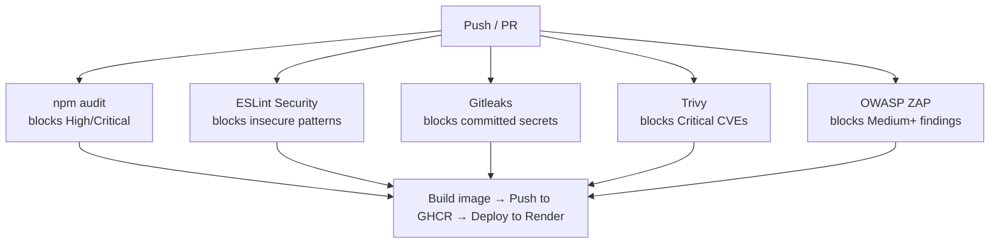

# Smart Home Energy Simulator — DevSecOps Edition

A full-stack smart home energy simulation app with a **production-grade DevSecOps pipeline** — automated security scanning, containerized deployment, observability, and load testing.

**Live Demo:** [smart-home-energy-demo.vercel.app](https://smart-home-energy-demo.vercel.app)  
**Backend API:** [smart-home-backend-latest.onrender.com](https://smart-home-backend-latest.onrender.com/health)


## Architecture




## Security Pipeline

Every push to `main` or `devsecops` runs 4 automated security gates in parallel. **All must pass before deployment.**

|       Stage            |              Tool               |             What it catches         |    Blocks on     |
|------------------------|---------------------------------|-------------------------------------|------------------|
| Dependency Audit (SCA) | `npm audit`                     | Known CVEs in packages              | High/Critical    |
| Static Analysis (SAST) | ESLint + eslint-plugin-security | Insecure code patterns              | Any violation    |
| Secret Scanning        | Gitleaks                        | Committed secrets/tokens            | Any secret found |
| Container Scanning     | Trivy                           | OS + library CVEs in Docker image   | Critical CVEs    |
| DAST                   | OWASP ZAP                       | Runtime: missing headers, CORS, XSS | Medium+ findings |

### Pipeline Flow




## Backend Stack

- **Framework:** NestJS (TypeScript) — modular, dependency injection, layered architecture
- **Auth:** Stateless JWT — horizontally scalable, no shared session state
- **Load Balancer:** Nginx — round-robin across 2 replicas, rate limiting (200 req/s)
- **Containerization:** Multi-stage Docker build — ~70% smaller image, zero dev deps in prod
- **Registry:** GitHub Container Registry (GHCR)
- **Hosting:** Render (auto-deploys on every successful pipeline run)


## Observability

Prometheus scrapes `/metrics` from both app replicas every 15 seconds. Grafana dashboards show:

- **HTTP Request Rate** — requests/sec per route and instance
- **Login Attempts** — `login_attempts_total` split by `result="success"` / `result="failure"`
- **p95 Request Latency** — `histogram_quantile(0.95, rate(http_request_duration_seconds_bucket[5m]))`

> A spike in `login_attempts_total{result="failure"}` is an indicator of a brute-force attempt — this ties observability directly back to the security theme.


## Load Testing (k6)

Three traffic scenarios validated against Docker Compose:

| Scenario |      VUs    | Duration |     Purpose         |
|----------|-------------|----------|---------------------|
|  Normal  | 10          |   1 min  | Baseline behaviour  |
|  Spike   | 0 → 100 → 0 |   50s    |   Burst capacity    |
|  Soak    | 30          |   2 min  | Sustained stability |

**Results:** p95 latency = 3.34ms · failure rate = 4.43% (intentional) · all thresholds ✅

```bash
k6 run load-test/k6.js
```


## Local Development

```bash
# Start full stack
NGINX_PORT=8080 docker compose up -d --build

# Test endpoints
curl http://localhost:8080/health
curl -X POST http://localhost:8080/api/auth/login \
  -H "Content-Type: application/json" \
  -d '{"username": "demo", "password": "demo123"}'

# View metrics
curl http://localhost:8080/metrics

# Grafana dashboard
open http://localhost:3030   # admin / admin

# Run load test
k6 run load-test/k6.js
```

---

## Project Structure
```
smart-home-energy-demo/
├── backend/
│   └── src/
│       ├── auth/            # JWT authentication
│       ├── devices/         # Devices module
│       └── metrics/         # Prometheus metrics
├── .github/
│   └── workflows/
│       ├── dast.yml         # OWASP ZAP baseline scan
│       ├── deploy.yml       # Build + push to GHCR + deploy to Render
│       ├── image-scan.yml   # Trivy container scanning
│       ├── npm-audit.yml    # Dependency audit (SCA)
│       ├── secret-scan.yml  # Gitleaks secret scanning
│       ├── semgrep.yml      # Semgrep SAST
│       ├── vercel.yml       # Vercel preview deploy
│       └── README.md
├── load-test/
│   └── k6.js                # k6 load test (normal/spike/soak)
├── docker-compose.yml
├── nginx.conf
├── prometheus.yml
├── vercel.json
├── SECURITY.md
└── README.md
```

## Talking Points

- **Shift-left security** — vulnerabilities caught at commit time, not in production
- **Stateless JWT auth** — any replica verifies tokens without shared state
- **Multi-stage Docker** — 70% smaller image, zero dev dependencies in prod
- **DAST vs SAST** — SAST finds source issues, DAST finds runtime issues SAST can't see
- **Observability as security** — login failure spikes indicate brute-force attempts
- **Load test validated load balancing** — per-replica request counts equalized during spike
